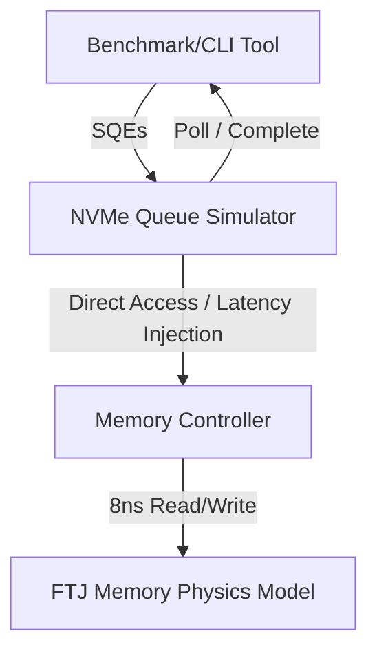

# FTJ Memory Engine Simulator - Architecture Design

This document outlines the system architecture for the high-performance, byte-addressable **Ferroelectric Tunnel Junction (FTJ)** memory engine simulator, targeting Windows using C++20.

---

## 1. System Overview
The simulator models a high-speed solid-state storage device leveraging FTJ cells as the storage medium. Unlike traditional flash memory, FTJs offer **byte-addressability, sub-10ns write/read latencies (modeled at exactly 8ns), and near-zero wear (unlimited write endurance)**. The system is designed to simulate these physical characteristics under intensive IO patterns.

---

## 2. Core Modules

### 2.1 FTJ Memory Physics Model
The core simulation layer modeling the physical properties of Ferroelectric Tunnel Junction cells.

- **Characteristics**:
  - **Latency**: Fixed 8ns latency for both read and write operations.
  - **Endurance**: Zero-wear (infinite cycles) model; no write amplification or wear-leveling algorithms are simulated or required.
  - **Access Granularity**: Byte-addressable. The memory space is exposed as a contiguous virtual address space, mapping directly to system memory via lockless allocation or direct pointer arithmetic.
  - **State Simulation**: Emulates the polarization switching of the ultra-thin ferroelectric barrier, resulting in Giant Tunneling Electroresistance (TER) between high-resistance state (HRS, logical '0') and low-resistance state (LRS, logical '1').

### 2.2 NVMe Queue Simulator
Implements high-performance, asynchronous queue management matching NVMe-over-PCIe/asynchronous architectures.

- **Structure**:
  - Pair of lock-free circular ring buffers per queue channel: **Submission Queue (SQ)** and **Completion Queue (CQ)**.
  - **Doorbell Registers**: Ring updates are signaled via memory-mapped doorbells, optimized for polling mode to minimize OS context-switch overhead under high-IOPS conditions.
  - **Execution Engines**: A thread pool consumes submission queue entries (SQEs) and issues them to the FTJ controller, injecting the physical latencies before placing completion queue entries (CQEs) onto the CQ.

### 2.3 IOPS Benchmark Suite
A measurement and performance validation module.

- **Workload Generator**:
  - Configurable workloads: Sequential / Random Read, Write, and Mixed (e.g., 70/30 read/write).
  - Variable Queue Depths (QD1 to QD256) and thread/worker counts.
- **Metrics & Histograms**:
  - Real-time IOPS (Input/Output Operations Per Second) tracking.
  - Throughput calculation (GB/s).
  - Latency histograms tracking min, max, average, and high-percentile (p99, p99.9, p99.99) latency distribution, capturing the simulated 8ns access times and queue overhead.

---

## 3. Technology & Target Platform
- **Language Standard**: C++20 (utilizing concepts, coroutines, and `std::jthread`).
- **Operating System**: Windows (optimizing for Windows thread scheduler and high-precision timers like `QueryPerformanceCounter` / `QueryPerformanceFrequency`).
- **Memory Management**: Hugepages/VirtualAlloc for physical memory mappings to achieve maximum pointer lookup speeds.
