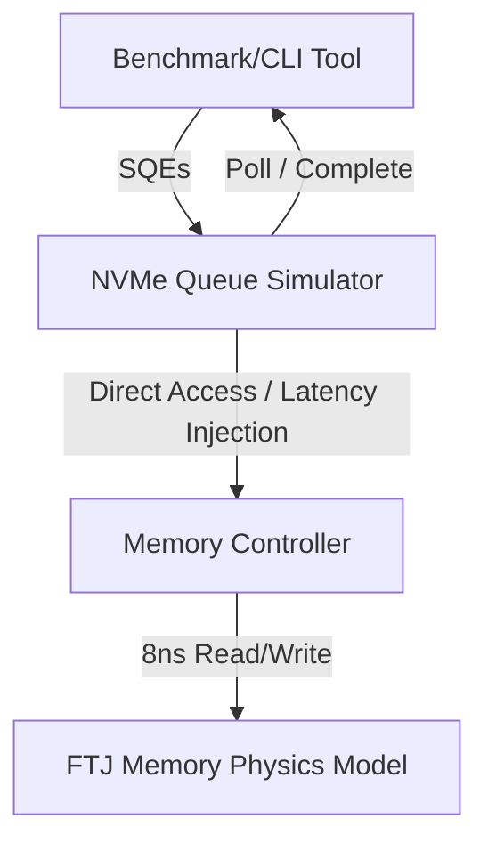

# FTJ Memory Engine Simulator - Architecture Design

This document outlines the system architecture for the high-performance, byte-addressable **Ferroelectric Tunnel Junction (FTJ)** memory engine simulator, targeting Windows using C++20.

---

## 1. System Overview
The simulator models a high-speed solid-state storage device leveraging FTJ cells as the storage medium. Unlike traditional flash memory, FTJs offer **byte-addressability, sub-10ns write/read latencies (modeled at exactly 8ns), and near-zero wear (unlimited write endurance)**. The system is designed to simulate these physical characteristics under intensive IO patterns.

---

## 2. Core Modules

### 2.1 FTJ Solid-State Physics & Crossbar Array Model
The core simulation layer modeling the physical properties of Ferroelectric Tunnel Junction cells, 2D crossbar mesh networks, and 1S-1R threshold selectors.

- **Solid-State Physics Characteristics**:
  - **Switching Dynamics**: Non-linear polarization switching kinetics modeled via **Merz's Law**:
    $$\tau_{\text{switch}}(V) = \tau_0 \cdot \exp\left(\frac{\alpha E_a}{V_{\text{eff}}}\right)$$
  - **Crossbar IR-Drop Solver**: Dynamic calculation of voltage attenuation across resistive Word-Lines ($R_{\text{wire\_WL}}$) and Bit-Lines ($R_{\text{wire\_BL}}$) under sneak-path currents suppressed by 1S-1R threshold switching selectors.
  - **Tunnel Electroresistance (TER) & Temperature Drift**: Models the degradation of the $R_{\text{HRS}} / R_{\text{LRS}}$ sensing margin across operating temperatures ($25^\circ\text{C}$ to $125^\circ\text{C}$).
  - **Half-Select Disturb & HAR-SM**: Models polarization relaxation on unselected neighbor cells subject to $V_w/2$ half-select pulses, tracked with an autonomous **Hardware Autonomous Refresh State Machine (HAR-SM)**.
  - **Endurance & Error Correction**: Real-time bit-flip injection beyond wear/disturb thresholds, protected by hardware-level **Hamming SECDED (72, 64)** Codecs.

### 2.2 NVMe Queue Simulator
Implements high-performance, asynchronous queue management matching NVMe-over-PCIe/asynchronous architectures.

- **Structure**:
  - Pair of lock-free circular ring buffers per queue channel: **Submission Queue (SQ)** and **Completion Queue (CQ)** using Dmitriy Vyukov's MPMC algorithm.
  - **Doorbell Registers**: Ring updates are signaled via memory-mapped doorbells, optimized for polling mode to minimize OS context-switch overhead under high-IOPS conditions.
  - **Execution Engines**: A thread pool consumes submission queue entries (SQEs) and issues them to the FTJ controller, injecting physics-calibrated switching latencies before placing completion queue entries (CQEs) onto the CQ.

### 2.3 IOPS Benchmark Suite
A measurement and performance validation module.

- **Workload Generator**:
  - Configurable workloads: Sequential / Random Read, Write, and Mixed (e.g., 70/30 read/write).
  - Variable Queue Depths (QD1 to QD256) and thread/worker counts.
- **Metrics & Histograms**:
  - Real-time IOPS (Input/Output Operations Per Second) tracking.
  - Throughput calculation (GB/s).
  - Latency histograms tracking min, max, average, and high-percentile (p99, p99.9, p99.99) latency distribution, capturing the simulated 8ns access times and queue overhead.
  - Hardware physics telemetry tracking maximum IR-drop, TER sensing margin compression, disturb frequency, and autonomous restorative refresh counts.

---

## 3. Technology & Target Platform
- **Language Standard**: C++20 (utilizing concepts, coroutines, and `std::jthread`).
- **Hardware Description**: Synthesizable Verilog-2001 (`ftj_top_controller.v`, `ftj_submission_queue.v`) with Analog Front-End (AFE) Current Sense Amplifier models and HAR-SM refresh controllers.
- **Operating System**: Windows (optimizing for Windows thread scheduler and high-precision timers like `QueryPerformanceCounter` / `QueryPerformanceFrequency`).
- **Memory Management**: Hugepages/VirtualAlloc for physical memory mappings to achieve maximum pointer lookup speeds.
