# Technology Development & Startup Grant Proposal
**Scheme Target**: NIDHI-PRAYAS (Department of Science & Technology, Government of India) / MeitY TIDE 2.0  
**Host Incubator**: St. Xavier's University, Kolkata (SXUK) Incubation & Entrepreneurship Cell  

---

## 1. Project Overview & Meta-Data
*   **Project Title**: Next-Generation Ferroelectric Tunnel Junction (FTJ) Memory Controller & Hardware Simulator
*   **Domain**: Semiconductors, Embedded Systems, Enterprise Storage Devices
*   **Project Category**: Deep-Tech Hardware & System Architecture
*   **Applicant Age Group**: Student Innovator (Under 21)
*   **Target Funding**: ₹10,00,000 (Ten Lakhs INR - maximum limit under NIDHI-PRAYAS)

---

## 2. Problem Statement: The AI Storage Bottleneck & Market Inflation
The artificial intelligence boom (LLMs, Vector Databases, Retrieval-Augmented Generation) has caused a severe demand-supply mismatch in enterprise hardware. 
1.  **DRAM Inflation**: High-bandwidth volatile memory is extremely expensive, driving up server build costs.
2.  **NAND Flash Wear-Out**: Existing Solid State Drives (SSDs) use 3D NAND flash memory. Under heavy AI cache workloads (such as LLM KV-caching), SSDs wear out within months due to limited write cycles (~3,000 erases) and high Write Amplification.
3.  **The Block Erase Penalty**: Traditional flash storage cannot overwrite data at the byte level. It must erase entire blocks (taking 3ms), creating severe latency spikes (jitter) in high-throughput databases.

---

## 3. The Proposed Solution: The FTJ Memory Engine
We propose a hardware-software co-design of a **Ferroelectric Tunnel Junction (FTJ) Memory Controller**. 
*   **Physics of FTJ**: Uses a thin ferroelectric layer (doped Hafnium Oxide, $\text{HfO}_2$) sandwiched between electrodes. By switching electrical polarization, it stores bits without physical wear, achieving near-infinite endurance.
*   **Nanosecond Latency**: Direct byte-level reads (~8ns) and writes (~300ns) operating at near-DRAM speeds.
*   **Zero-Erase Overhead**: Direct-write capability eliminates the need for background garbage collection, eliminating latency spikes.
*   **The Controller**: An architecture implementing parallel NVMe-style submission/completion queues and Error-Correcting Code (SECDED Hamming 72/64) to ensure data protection.

---

## 4. Technical Feasibility & Innovation (Why it is viable)
Instead of targeting cutting-edge sub-7nm manufacturing nodes (which are monopolized and expensive), our hardware design utilizes **mature 28nm planar foundries**.
*   **Low Entry Barrier**: A mask set for 28nm costs ₹15–20 Crores ($2-3M USD), compared to ₹400+ Crores ($50M+ USD) at 3nm.
*   **CMOS Compatibility**: Hafnium Oxide is already standard in modern semiconductor back-end-of-line (BEOL) processing, meaning existing mature foundries can manufacture this chip with zero retooling.
*   **Verified Simulation**: We have built a functional C++20 simulator proving that FTJ logic achieves up to **486x faster write latencies** and **Million-level IOPS** compared to standard flash memory.

---

## 5. Milestone & Implementation Roadmap (12 Months)

```mermaid
gantt
    title NIDHI-PRAYAS 12-Month Development Plan
    dateFormat  X
    axisFormat Month %o
    
    selected_phase: FPGA Verilog Implementation :active, 0, 4
    Simulation Benchmarking     :active, 2, 5
    
    FPGA-to-Host Integration    : 4, 8
    Custom Telemetry & Drivers  : 6, 10
    
    Provisional Patent Filings  : 8, 11
    Incubation & Seed Pitch     : 10, 12
```

*   **Milestone 1 (Months 1–4)**: Translate the C++ lock-free queue and memory-controller logic into **Verilog/SystemVerilog HDL**. Program the logic blocks onto an FPGA development board.
*   **Milestone 2 (Months 5–8)**: Connect the FPGA prototype to a host PC using PCIe/CXL protocol logic and test physical data transfers.
*   **Milestone 3 (Months 9–12)**: File a provisional patent for the controller's wear-tracking and error-recovery algorithms. Pitch to venture capitalists for a seed round to tape-out a 28nm test chip.

---

## 6. Budget Allocation (Total: ₹10,00,000)

| Budget Head | Item Description | Estimated Cost (INR) |
| :--- | :--- | :---: |
| **Hardware & Boards** | Xilinx/AMD Kintex-7 FPGA Development Board (for PCIe validation) | ₹2,50,000 |
| **Lab Equipment** | Logic Analyzer & High-Speed Oscilloscope accessories | ₹2,00,000 |
| **Software Licenses** | EDA design tools and HDL simulation licenses | ₹1,50,000 |
| **R&D Consumables** | High-performance workstation, testing cables, SSD enclosures | ₹1,80,000 |
| **Intellectual Property** | Patent filing fees & professional attorney charges for Indian filing | ₹1,20,000 |
| **Travel & Collaboration** | Travel to testing centers (IIT Kharagpur/JU labs) for verification | ₹1,00,000 |
| **Total** | | **₹10,00,000** |

---

## 7. Commercialization Strategy & Market Potential
*   **Initial Market**: Custom CXL accelerators for high-frequency trading (HFT) platforms and real-time database servers (PostgreSQL / RocksDB) in the Indian enterprise sector.
*   **Expansion Plan**: License the controller IP to global SSD manufacturers as a co-processor module for hybrid SSDs.
*   **Make in India Alignment**: Fully aligned with India's Semiconductor Mission (ISM) to build design-led semiconductor IP locally.
